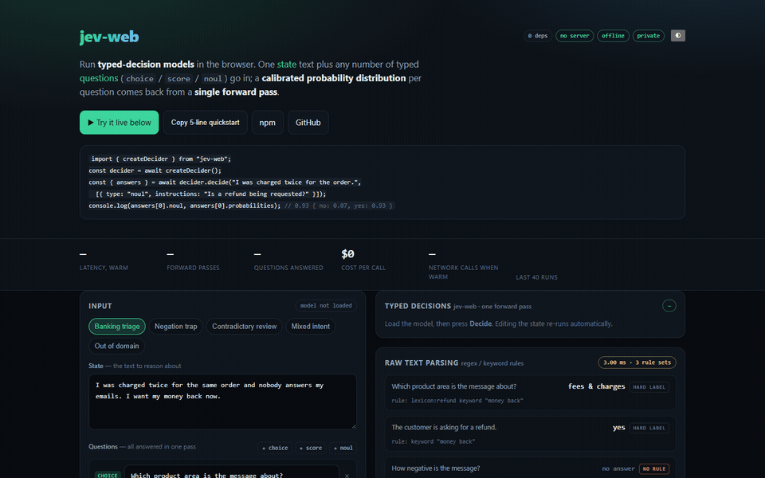
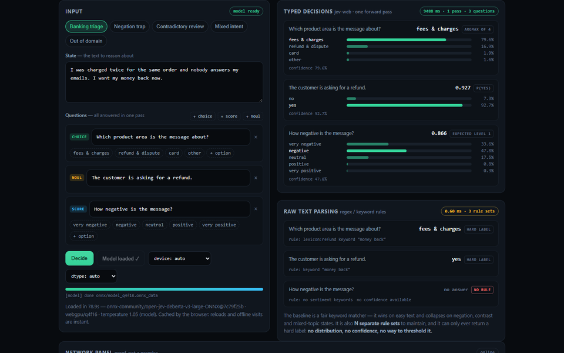
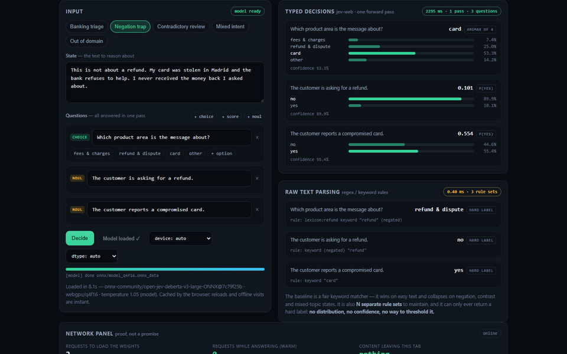

# jev-web

[](https://www.npmjs.com/package/jev-web)
[](./LICENSE)
[](https://github.com/warsang/jev-web/actions/workflows/test.yml)

Run **open-jev-shaped typed-decision models** in the browser. One *state* text
plus any number of typed *questions* (`choice` / `score` / `noul`) go in; a
calibrated probability distribution per question comes back from a **single
forward pass**. No server, no API keys, no network calls after the weights are
cached.

This is a generic runtime, not a classifier for any particular domain. You bring
the state text and the questions; the model answers by choosing among the options
you give it.

## ▶ Live demo

**https://warsang.github.io/jev-web/**

An interactive playground that runs this exact package: type a state, add typed
questions, and watch the model and a hand-written keyword baseline answer
side by side. It also counts your actual outbound requests, so the
"offline / private / no server" claim is checkable rather than asserted.



<sub>The frames are captured from the live demo at
[warsang.github.io/jev-web](https://warsang.github.io/jev-web/) — site → typed
decisions with latency → the negation case where the rules and the model
disagree → the comparison matrix.</sub>

Three questions, one forward pass, and a hard label from the rule parser that
could not answer the third question at all:



## Quickstart

```js
import { createDecider } from "jev-web";

const decider = await createDecider();          // ~340 MB of weights, once
const { answers } = await decider.decide(
  "I was charged twice for the same order.",
  [{ type: "noul", instructions: "The customer is asking for a refund." }],
);

answers[0].noul;                    // 0.92   — p(yes)
answers[0].probabilities;           // { no: 0.08, yes: 0.92 }
answers[0].confidence;               // 0.92
```

That is the whole integration. The first call downloads the weights and the
browser caches them; every later call — and every later visit, including
offline — is local. **Zero dependencies**: `@huggingface/transformers` is an
optional peer, imported lazily.

## What comes back

```js
const { answers } = await decider.decide(
  "I was charged twice for the same order and nobody answers my emails. I want my money back now.",
  [
    { type: "choice", instructions: "Which product area is the message about?",
      options: ["fees & charges", "refund & dispute", "card", "other"] },
    { type: "noul",   instructions: "The customer is asking for a refund." },
    { type: "score",  instructions: "How negative is the message?",
      options: ["very negative", "negative", "neutral", "positive", "very positive"] },
  ],
);

// [
//   { type: "choice", choice: "fees & charges", index: 0,
//     probabilities: { "fees & charges": 0.796, "refund & dispute": 0.169,
//                      card: 0.019, other: 0.016 }, confidence: 0.796 },
//   { type: "noul", noul: 0.927,
//     probabilities: { no: 0.073, yes: 0.927 }, confidence: 0.927 },
//   { type: "score", score: 0.866, level: 1,
//     probabilities: { "very negative": 0.336, negative: 0.478, neutral: 0.175,
//                      positive: 0.008, "very positive": 0.003 }, confidence: 0.478 },
// ]
// timings: { totalMs, inferMs }   ·  length, truncated, prompts
```

Three questions, **one** forward pass, and every question carries the full
distribution — not just a label. That last part is the point: a hard label
cannot be thresholded, routed by confidence, or second-guessed, and the
`choice` answer above is a genuine 79.6 / 16.9 split rather than a coin flip you
find out about later.

## jev-web vs. calling a hosted LLM API with `fetch()`

| | jev-web | Hosted LLM API via `fetch()` |
|---|---|---|
| **Cost per decision** | **$0.00** — the weights are static files | per-token, forever; a busy form multiplies it by every visitor |
| **Latency** | one local forward pass, measured live on the demo page | typically 0.4–3 s, plus a network round trip |
| **Network at answer time** | **0 requests** — works in airplane mode | one round trip per call, minimum |
| **Output shape** | **calibrated distribution per question, every question in one pass** | prose you then have to regex back into a distribution |
| **Determinism** | same input → same probabilities, always | temperature 0 + structured outputs helps; still not guaranteed |
| **Privacy** | your text never leaves the device | your users' text is sent to a third party on every call |
| **Ops burden** | static files on a CDN, no key, no rate limit | key management, quotas, rate limits, uptime, spend alerts |
| **Ceiling** | only *picks among options you supply* — never writes, never explains | general purpose; will happily invent an option you never offered |

**The honest trade.** jev-web is a classifier, not a chatbot. If you need
free-form answers you need a generator. If you need a routing decision, a score,
or a yes/no with a confidence you can threshold on, this is the cheaper, faster
and private one — and it is also *smaller*: a 0.5 B model plus your options
beats a frontier model plus a parsing layer, on every axis except generality.

## Try it before you install it

The live demo covers the interesting cases, and the presets are chosen to break
keyword parsing rather than to flatter the model:

| preset | what it shows |
|---|---|
| **Banking triage** | easy text — a fair rule can match, the model adds a confidence |
| **Negation trap** | *"This is not about a refund. My card was stolen…"* — the keyword rule routes to `refund & dispute`; the model routes to `card` (53.3%) and answers the refund question **no** (0.101) |
| **Contradictory review** | praise and complaint in one sentence; keyword polarity reads the praise |
| **Mixed intent** | two intents in one state — a hard label must pick one, a distribution does not have to |
| **Out of domain** | no in-domain signal at all; the rule parser has nothing to say |

The negation case is the one worth looking at. The state is *"This is not about
a refund. My card was stolen in Madrid and the bank refuses to help. I never
received the money back I asked about."*



The rule parser finds the word `refund` and routes to **refund & dispute** — the
exact opposite of what the customer meant. The model routes to **card** (53.3%)
and answers *"the customer is asking for a refund"* with **no** (0.101). Both
the bad routing and the inversion come from the same clause, and neither is
visible in a hard label.

The demo also tracks outbound requests through the Performance API: you will see
~14 requests while the weights load, then **0** for every decision after that.

## Install

```bash
npm i jev-web @huggingface/transformers
```

`@huggingface/transformers` is an optional peer dependency (it is imported
lazily). Hosts that already ship their own copy can inject it via
`createDecider({ transformers })`.

## Use

```js
import { createDecider, DEFAULT_MODEL, DEFAULT_REVISION } from "jev-web";

const decider = await createDecider({
  // defaults to the reference open-jev DeBERTa-v3-large ONNX export,
  // pinned by revision; any repo with the same typed-decision graph works
  onProgress: (p) => console.log(p.phase, p.file, p.progress),
});

const { answers } = await decider.decide(
  "I was charged twice for the same order and nobody answers my emails.",
  [
    {
      type: "choice",
      instructions: "Which product area is the message about?",
      options: ["fees & charges", "refund & dispute", "card", "other"],
    },
    { type: "noul", instructions: "The customer is asking for a refund." },
    {
      type: "score",
      instructions: "How negative is the message?",
      options: ["very negative", "negative", "neutral", "positive", "very positive"],
    },
  ],
);
```

## Question types

| type | options | answer |
|---|---|---|
| `choice` | 2–255 labels | `choice` (argmax), `probabilities`, `confidence` |
| `score` | 2–10 ordered levels | `score` (expected level index, may fall between levels) |
| `noul` | exactly 2 (defaults `["no","yes"]`) | `noul` (p of the second option = p(yes)), `confidence` |

Every answer carries the full distribution. `decide()` also returns
`{ truncated, length }` — the state is capped (256 tokens by default) and the
flag tells you when it was cut.

## Backends and quantization

`device` / `dtype` default to `auto`: WebGPU → `q4f16`, otherwise WASM → `q4`.
Override explicitly (`fp16`, `fp32`, `q8`, …) when accuracy matters more than
download size. First load downloads the weights once; transformers.js caches
them (Cache API / IndexedDB) so later visits are offline-fast.

`decider.info` reports the resolved `{ model, revision, device, dtype,
temperature, maxStateTokens, maxLen, pool, configSource }`.

## Model config

Defaults come from the model repo's `open_jev_config.json` when present
(temperature, marker tokens, state cap), else the published reference values.
To use a different typed-decision export:

```js
createDecider({ model: "your-org/your-typed-decision-ONNX", revision: "main" });
```

The export must add the `[STATE]`, `[Q]`, `[OPT]` markers to its tokenizer,
take `input_ids, attention_mask, seg, pair_q, pair_opt`, and return per-pair
`logits`. `typedMarkerIds()` fails loudly when a repo is missing them.

## Multiple families (registry)

`jev-web` is a multi-family runtime: `createDecisionRuntime({ family, fallback })`
tries the requested family and then any fallbacks, returning the shared contract
`{ info, decide(state, questions), dispose? }`:

```js
import { createDecisionRuntime, listDecisionFamilies } from "jev-web";

listDecisionFamilies(); // ["open-jev", "laya"]
const runtime = await createDecisionRuntime({
  family: "laya",
  fallback: ["open-jev"],
  onFallback: ({ family, error }) => console.warn(family, error),
});
const { answers, truncated, length, prompts, timings } = await runtime.decide(state, questions);
```

Third-party families plug in without touching core:

```js
registerDecisionFamily("my-model", {
  defaults: { model: "org/my-typed-decision-ONNX", revision: "main" },
  create: async (opts) => ({ info, decide, dispose }),
});
```

`decide()` returns `prompts` (decoded input sequence(s), for audit/debug) and
`timings` (per-stage ms) alongside the answers.

## Laya family (ModernBERT encoder + typed head)

`createLayaDecider(options)` runs the [Laya](https://huggingface.co/convaiinnovations/laya)
System-1 decision models, whose browser export is a **two-file q8 ONNX split**
(encoder + head) rather than one fused graph:

```js
import { createLayaDecider } from "jev-web";

const decider = await createLayaDecider({
  // defaults to alfred361/laya-typed-decisions-web-q8 @ pinned revision
  wasmPaths: "/assets/",            // self-hosted ORT wasm (optional)
  onProgress: (p) => console.log(p.phase, p.loaded, p.total),
});
const { answers } = await decider.decide(stateText, questions);
```

Protocol implemented here (mirrors the reference `laya` Python runtime):

- sequence `[CLS] <type> question: <instructions> [SEP] [MASK]opt0 … [SEP] <state> [SEP]`,
  `marker_pos` at each option's `[MASK]`, `qtype` 0 choice / 1 score / 2 noul;
- encoder `input_ids, attention_mask → hidden`; head
  `hidden, attention_mask, marker_pos, marker_mask, qtype → logits`;
- per-question calibration from `rl_agent_config.json`
  (`temperature` + `temperature_by_options` buckets, clamped to [0.5, 5]).

Notes:
- the q8 web head is **batch-1 only**, so `decide()` batches the encoder and
  runs the head once per question;
- `choice` supports at most `max_prefixes` options (6 for the typed-decisions
  export);
- weights download once (~520 MB q8) and are browser-cached.

Lower-level helpers are exported for custom runtimes:
`buildLayaSequence`, `collateLayaItems`, `layaAnswersFromLogits`,
`layaTokenizerAdapter`, `renderLayaOptions`, `layaTempBucket`, `clampTemperature`.

## Worker / thread

`jev-web` does not bundle a worker, so hosts can create one the way their
bundler prefers:

```js
// host code
const worker = new Worker(new URL("./my-worker.mjs", import.meta.url), { type: "module" });
// my-worker.mjs
import { createDecider } from "jev-web";
```

## API

- `createDecider(options)` → open-jev family: `{ info, decide, decideMany, dispose }`
- `createLayaDecider(options)` → Laya family: `{ info, decide, dispose }` (same `decide` contract)
- `normalizeQuestions`, `buildDecisionInput`, `typedMarkerIds`, `answersFromScores`,
  `softmaxWithTemperature`, `resolveDevice`, `resolveDtype`, `detectWebGPU`,
  `loadModelConfig`, defaults (model/revision/temperature/caps).

## Demos

- **Live demo** — <https://warsang.github.io/jev-web/> (built from `demo/`, deployed on every push)
- **Local playground** — `npm run dev` → <http://localhost:5188>. Same ideas, plus
  COOP/COEP headers that unlock `SharedArrayBuffer` for the threaded
  onnxruntime-web build (GitHub Pages cannot set those headers, so the deployed
  demo runs single-threaded).
- **Verify a change visually** — `node tools/shot.mjs jobs.json` drives headless
  Chrome over CDP, waits on a real DOM condition, and reports the page's own
  console errors. The GIF in this README was built with it. It exists because a
  screenshot alone cannot tell you a promise is silently rejecting.

## Limits

- Typed-decision models answer **only** by picking among your options; they do
  not explain or generate text.
- Accuracy is domain-bound: questions and states unlike the model's training
  domain are out of distribution. Measure before relying on any answer.
- English, 512-token sequence (state capped), one state per forward pass.

## License

MIT (runtime code). Model weights keep their own license (the reference export
is Apache-2.0).
